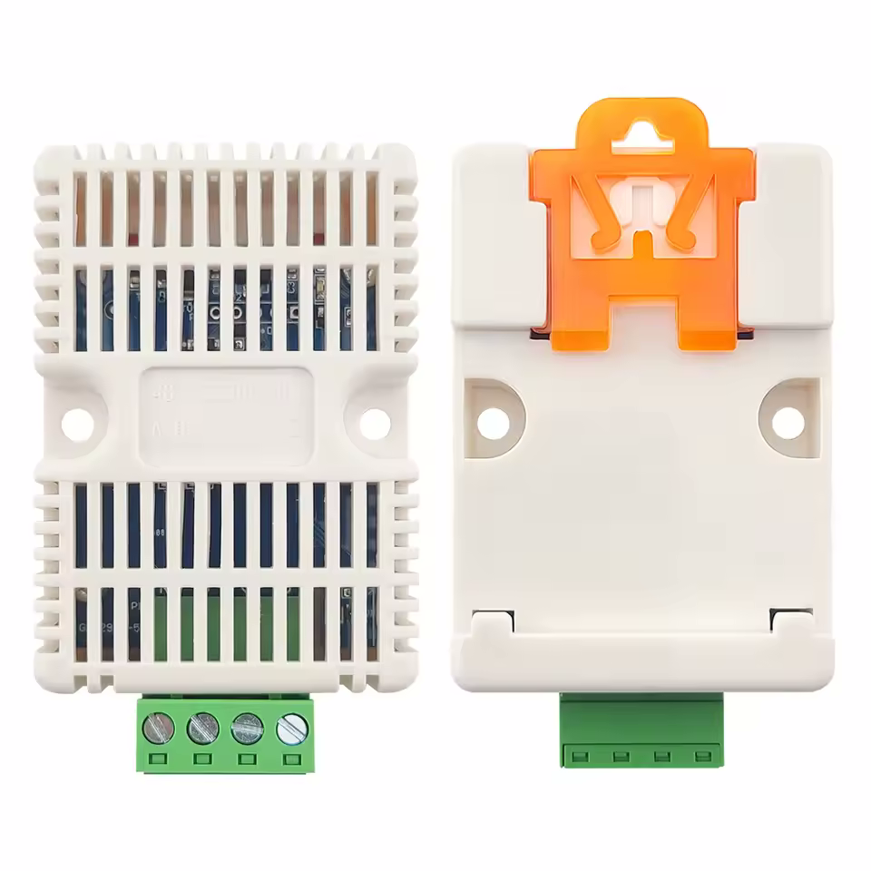

# SHT30 MODBUS RTU RS485 Sensor Protocol [zts-3008-ws-n01]

This document describes the custom serial protocol used by the RS485 Modbus SHT30 sensor (white case) for auto-detection and configuration of the baud rate and slave ID.

I reverse engineered this by capturing the serial traffic between the sensor and the manufacturers software (see references).



---

## Protocol Overview

Communication happens over RS485 using a **custom 7-byte command frame**, both for querying and configuring baud rate and slave ID.


#### Default Configuration

| Item      | Default Value |
| --------- | ------------- |
| Baud Rate | 4800          |
| Slave ID  | 0x01          |
| Data Bits | 8             |
| Stop Bits | 1             |
| Parity    | None          |

---

## Command Frame Format

| Byte Index | Description   | Notes                                                                                                    |
| ---------- | ------------- | -------------------------------------------------------------------------------------------------------- |
| 0–2        | Header        | Fixed sequence: `0xFD 0xFD 0xFD`                                                                         |
| 3          | Baud Rate ID  | `0x00` = unspecified / no change<br>`0x01` = 2400 baud<br>`0x02` = 4800 baud<br>`0x03` = 9600 baud, etc. |
| 4          | Slave ID      | `0x00` = unspecified / no change<br>`0x01` - `0xFF` = Slave address                                      |
| 5          | CRC Low Byte  | CRC16 (Modbus polynomial) low byte                                                                       |
| 6          | CRC High Byte | CRC16 (Modbus polynomial) high byte                                                                      |

---

## How to Use the Protocol

Remember: The final two bytes (the CRC bytes) change depending on the payload data. When sending requests, you need to calculate the correct MODBUS CRC 16.

### Query Current Baud Rate and Slave ID

- Send a frame with **both Baud Rate ID and Slave ID set to `0x00`**.
- The sensor replies with the same frame format but replaces these bytes with the **current configured baud rate and slave ID**.
- Note: this method won’t work if you don’t know the baud rate beforehand, because the sensor will not respond to requests sent at the wrong baud rate. In that case, try sending the query at each supported baud until you get a response.

**Example request to query current settings:**

```
FD FD FD 00 00 E9 88
```

**Example response:**

```
FD FD FD 03 01 28 B8
```

* `03` = baud rate ID (9600 baud, see baud rate table below)

* `01` = slave ID (decimal 1)

---

### Set Baud Rate

- To change baud rate, send a frame with:
  - `Slave ID = 0x00` (no change)
  - `Baud Rate ID` set to desired value (see Baud Rate IDs below)

##### Baud Rate IDs

Only these baud rates are supported. Attempting to write any other IDs will not work.  

| **ID (Hex)** | Baud Rate |
| ------------ | --------- |
| 0x01         | 2400      |
| 0x02         | 4800      |
| 0x03         | 9600      |

**Example to set baud rate to 9600 baud:**

```
FD FD FD 03 00 E9 78
```

The response is the same as the "Query Current Baud Rate and Slave ID" function.

---

### Set Slave ID

- To change slave ID, send a frame with:
  - `Baud Rate ID = 0x00` (no change)
  - `Slave ID` set to desired value

**Example to set slave ID to 8:**

```
FD FD FD 00 08 E8 4E
```

The response is the same as the "Query Current Baud Rate and Slave ID" function.

---

## CRC Calculation

- The CRC is a **Modbus RTU CRC16** checksum calculated over the first 5 bytes:

```
[Header (3 bytes)] + [Baud Rate ID] + [Slave ID]
```

- CRC is appended as **low byte first**, then **high byte**.

- Polynomial: `0x8005` (standard Modbus CRC16)

---

## Summary

| Action         | Baud ID Byte | Slave ID Byte | Notes                       |
| -------------- | ------------ | ------------- | --------------------------- |
| Query settings | 0x00         | 0x00          | Get current baud & slave ID |
| Set baud rate  | Desired baud | 0x00          | Change baud rate only       |
| Set slave ID   | 0x00         | Desired slave | Change slave ID only        |

All functions result in the same response.

---

## Appendix: Reading Temperature and Humidity

This can be done with the regular modbus functions `Read Holding Registers (0x03)` and `Read Input Registers (0x04)` (either works, despite the addresses not being writeable).

##### Register Table

| **Address** | **Measurement**   | **Range**     | **R/W**   | **Formula** |
| ----------- | ----------------- | ------------- | --------- | ----------- |
| 0x00        | Relative Humidity | 0 - 100 [%]   | Read only | value / 10  |
| 0x01        | Temperature       | -40 - 80 [°C] | Read only | value / 10  |

---

## References

- Modbus RTU CRC16 algorithm

- Reverse engineered from captured serial traffic on the [manufacturer’s config tool](https://github.com/nygma2004/km/blob/main/RS-WS-N01-8.zip).

- Image from the [AliExpress listing ](https://www.aliexpress.com/item/1005008801931769.html) I bought the item from.
